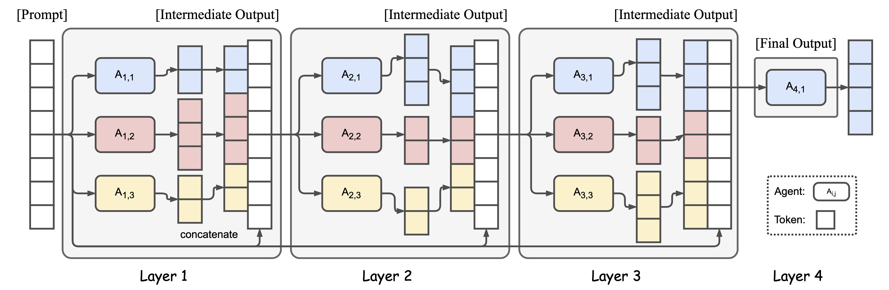
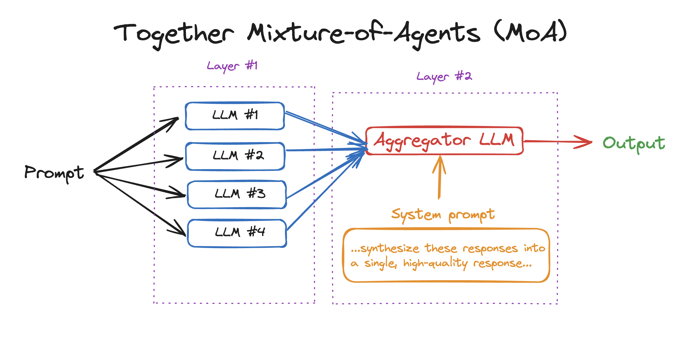
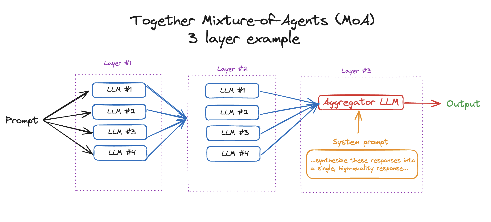
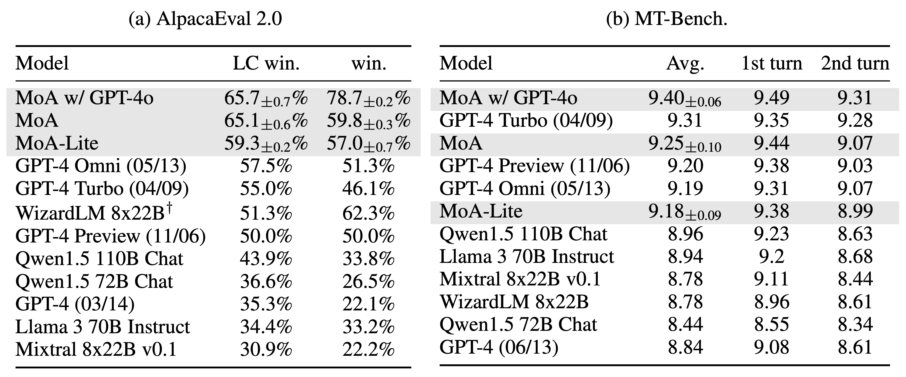
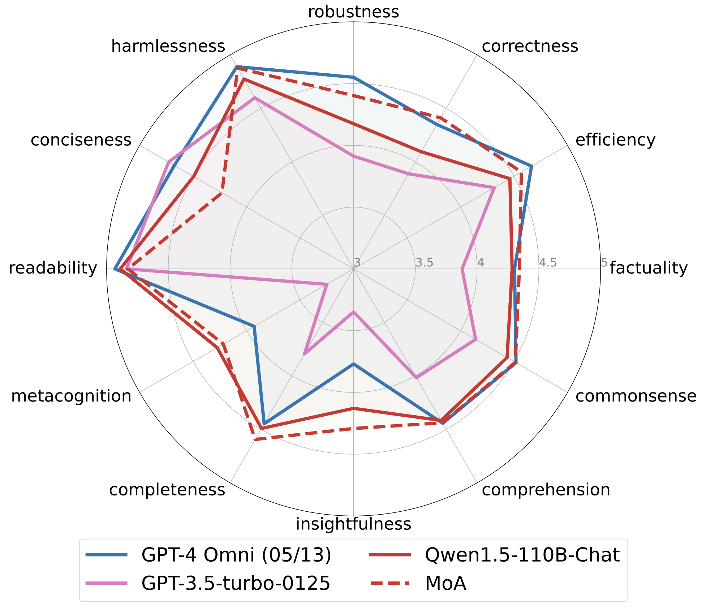

# Mixture-of-Agents (MoA)

[](LICENSE)
[](https://arxiv.org/abs/2406.04692)
[](https://discord.com/invite/9Rk6sSeWEG)
[](https://twitter.com/togethercompute)



<p align="center">
  <a href="#overview"><strong>Overview</strong></a> ·
  <a href="#quickstart-moa-in-50-loc"><strong>Quickstart</strong></a> ·
  <a href="#multi-layer-moa-example"><strong>Advanced example</strong></a> ·
  <a href="#interactive-cli-demo"><strong>Interactive CLI Demo</strong></a>
  ·
  <a href="#evaluation"><strong>Evaluation</strong></a>
  ·
  <a href="#results"><strong>Results</strong></a>
  .
  <a href="#credits"><strong>Credits</strong></a>
</p>

## Overview

Mixture of Agents (MoA) is a novel approach that leverages the collective strengths of multiple LLMs to enhance performance, achieving state-of-the-art results. By employing a layered architecture where each layer comprises several LLM agents, **MoA significantly outperforms GPT-4 Omni’s 57.5% on AlpacaEval 2.0 with a score of 65.1%**, using only open-source models!

## Quickstart: MoA in 50 LOC

To get to get started with using MoA in your own apps, see `moa.py`. In this simple example, we'll use 2 layers and 4 LLMs. You'll need to:

1. Install the Together Python library: `pip install together`
2. Get your [Together API Key](https://api.together.xyz/settings/api-keys) & export it: `export TOGETHER_API_KEY=`
3. Run the python file: `python moa.py`



## Multi-layer MoA Example

In the previous example, we went over how to implement MoA with 2 layers (4 LLMs answering and one LLM aggregating). However, one strength of MoA is being able to go through several layers to get an even better response. In this example, we'll go through how to run MoA with 3+ layers in `advanced-moa.py`.

```python
python advanced-moa.py
```



## Local and OpenAI-Compatible Providers

This workspace has been modified to use an OpenAI-compatible provider layer. It defaults to a local LM Studio server (`openai-compatible` at `http://127.0.0.1:1234/v1`) instead of Together — LM Studio can serve several models from one endpoint, which a mixture of agents needs (a llama.cpp `llama-server` process hosts only one model). Any OpenAI-compatible server works — LM Studio, llama.cpp, vLLM, a proxy — by pointing `MOA_BASE_URL` at it.

## Hybrid MoA Workbench

This fork includes a local web workbench for hybrid MoA workflows: orchestrator subtasks, parallel workers, synthesis, evaluator feedback, and approved file diffs.

Start the workbench:

```powershell
.\scripts\start_workbench.ps1
```

Open `http://127.0.0.1:5173`. The launcher starts the FastAPI backend and Vite GUI if they are not already running, writes logs under `%LOCALAPPDATA%\MoAWorkbench\logs`, and leaves existing listeners alone.

Manual backend/frontend commands are also available.

Run the backend:

```powershell
.\.venv\Scripts\python.exe -m uvicorn workbench.api:app --host 127.0.0.1 --port 8008
```

Run the GUI in another terminal:

```powershell
cd ui
npm run dev
```

Saved profiles and run history are stored under `%LOCALAPPDATA%\MoAWorkbench`.

The Profiles tab includes presets for llama.cpp, OMP ChatGPT/Claude routing, generic OpenAI-compatible proxies, Together, and an Atomic Agents placeholder. Profiles store provider names, base URLs, model IDs, and allowed file roots; API keys are read from environment variables such as `OMP_API_KEY`, `TOGETHER_API_KEY`, or `MOA_API_KEY` and are not saved in profile JSON.

### LM Studio (default — or llama.cpp / any local OpenAI-compatible server)

1. Start LM Studio's local server (default port 1234), load your models, and **enable parallel requests** in its server settings — the Workbench fans workers out concurrently, and a serialized server will queue them so runs look serial. Loading two or more different models gives you a real mixture; assign them roles on the Models tab.

2. Point MoA at the server and run:

```powershell
$env:MOA_PROVIDER = "openai-compatible"
$env:MOA_BASE_URL = "http://127.0.0.1:1234/v1"
$env:MOA_MODEL = "your-model-id"
$env:MOA_REFERENCE_MODELS = "your-model-id,another-model-id,your-model-id"
.\.venv\Scripts\python.exe bot.py
```

llama.cpp alternative: `llama-server -m your-model.gguf --port 1235 --parallel 4` and set `MOA_BASE_URL` to `http://127.0.0.1:1235/v1`. Note that one `llama-server` process hosts **one** model, so it suits self-ensembles rather than multi-model mixtures; the Workbench reads its slot count from `/props` and warns in the Run tab when the configured workers exceed it.

For a quick one-file example:

```powershell
.\.venv\Scripts\python.exe moa.py
```

> Note: a true *mixture* of agents needs more than one distinct model. With a single local model everywhere, runs are a self-ensemble (the GUI shows a notice when that's the case) — add a second local model or a cloud API model in the Profiles tab for real diversity.

### OMP or another OpenAI-compatible proxy

Use this when your proxy exposes ChatGPT, Claude, or other models through an OpenAI-compatible `/v1/chat/completions` endpoint:

```powershell
$env:MOA_PROVIDER = "omp"
$env:MOA_BASE_URL = "http://127.0.0.1:4141/v1"
$env:OMP_API_KEY = "your-proxy-key-if-needed"
$env:MOA_MODEL = "gpt-4o-mini"
$env:MOA_REFERENCE_MODELS = "gpt-4o-mini,claude-3-5-sonnet-latest"
.\.venv\Scripts\python.exe bot.py
```

Provider options: `openai-compatible` (aliases: `local`, `llamacpp`, `custom`), `together`, `openai`, `omp`, and `atomic`. There is no `lmstudio` provider — LM Studio is just an OpenAI-compatible server, so use `openai-compatible` with its base URL (usually `http://127.0.0.1:1234/v1`). The `atomic` option is intentionally a placeholder in `atomic_agents_adapter.py`.

## Interactive CLI Demo

This interactive CLI demo showcases a simple multi-turn chatbot where the final response is aggregated from various reference models.

To run the interactive demo with the local virtual environment:

```powershell
.\.venv\Scripts\python.exe bot.py
```

The CLI will prompt you to input instructions interactively:

1. Start by entering your instruction at the ">>>" prompt.
2. The system will process your input using the predefined reference models.
3. It will generate a response based on the aggregated outputs from these models.
4. You can continue the conversation by inputting more instructions, with the system maintaining the context of the multi-turn interaction.

### [Optional] Additional Configuration

The demo will ask you to specify certain options but if you want to do additional configuration, you can specify these parameters:

- `--model`: The primary model used for final response generation.
- `--reference-models`: List of models used as references.
- `--provider`: Backend provider to use (`openai-compatible`, `together`, `openai`, `omp`, or `atomic`).
- `--temperature`: Controls the randomness of the response generation.
- `--max-tokens`: Maximum number of tokens in the response.
- `--rounds`: Number of rounds to process the input for refinement. (num rounds == num of MoA layers - 1)
- `--multi-turn`: Boolean to toggle multi-turn interaction capability.

## Evaluation

We provide scripts to quickly reproduce some of the results presented in our paper
For convenience, we have included the code from [AlpacaEval](https://github.com/tatsu-lab/alpaca_eval),
[MT-Bench](https://github.com/lm-sys/FastChat), and [FLASK](https://github.com/kaistAI/FLASK), with necessary modifications.
We extend our gratitude to these projects for creating the benchmarks.

### Preparation

```bash
# install requirements
pip install -r requirements.txt
cd alpaca_eval
pip install -e .
cd FastChat
pip install -e ".[model_worker,llm_judge]"
cd ..

# setup api keys
export TOGETHER_API_KEY=<TOGETHER_API_KEY>
export OPENAI_API_KEY=<OPENAI_API_KEY>
```

### Run AlpacaEval 2

To run AlpacaEval 2, execute the following scripts:

```
bash run_eval_alpaca_eval.sh
```

### Run MT-Bench

For a minimal example of MT-Bench evaluation, run:

```
bash run_eval_mt_bench.sh
```

### Run FLASK

For a minimal example of FLASK evaluation, run:

```
bash run_eval_flask.sh
```

### Results

<div align="center">
  
  <br>
</div>

We achieved top positions on both the AlpacaEval 2.0 leaderboard and MT-Bench. Notably, on AlpacaEval 2.0, using solely open-source models, we achieved a margin of 7.6% absolute improvement from 57.5% (GPT-4 Omni) to 65.1% (MoA).

<div align="center">
  
  <br>
</div>

FLASK offers fine-grained evaluation of models across multiple dimensions. Our MoA method significantly outperforms the original Qwen1.5-110B-Chat on harmlessness, robustness, correctness, efficiency, factuality, commonsense, insightfulness, completeness. Additionally, MoA also outperforms GPT-4 Omni in terms of correctness, factuality, insightfulness, completeness, and metacognition.

Please feel free to contact us if you have difficulties in reproducing the results.

## Credits

Notably, this work was made possible by the collaborative spirit and contributions of active organizations in the AI field. We appreciate the efforts of Meta AI, Mistral AI, Microsoft, Alibaba Cloud, and DataBricks for developing the Llama 3, Mixtral, WizardLM 2, Qwen 1.5, and DBRX models. Additionally, we extend our gratitude to Tatsu Labs, LMSYS, and KAIST AI for developing the AlpacaEval, MT-Bench, and FLASK evaluation benchmarks.

## License

This project is licensed under the Apache 2.0 License - see the LICENSE file for details.

## Citation

If you find this work helpful, please consider citing:

```bibtex
@article{wang2024mixture,
  title={Mixture-of-Agents Enhances Large Language Model Capabilities},
  author={Wang, Junlin and Wang, Jue and Athiwaratkun, Ben and Zhang, Ce and Zou, James},
  journal={arXiv preprint arXiv:2406.04692},
  year={2024}
}
```
